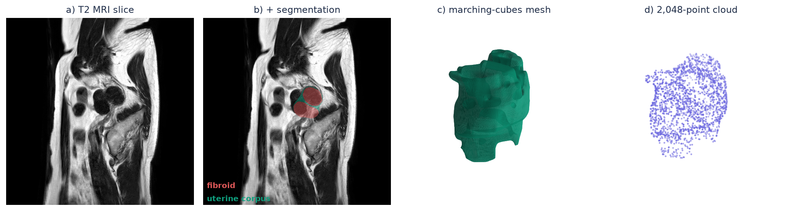
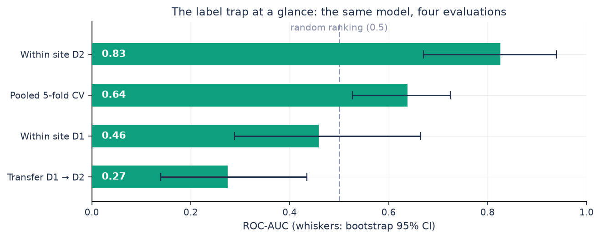
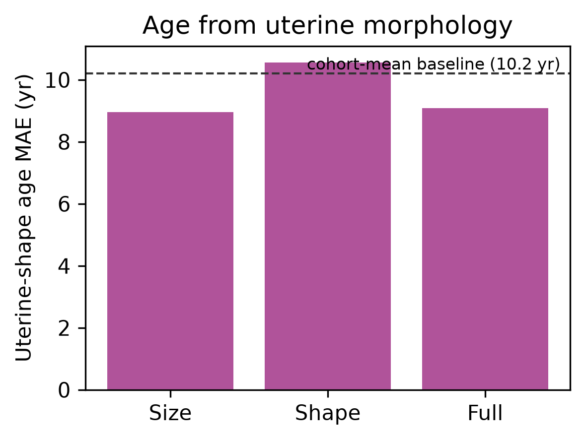
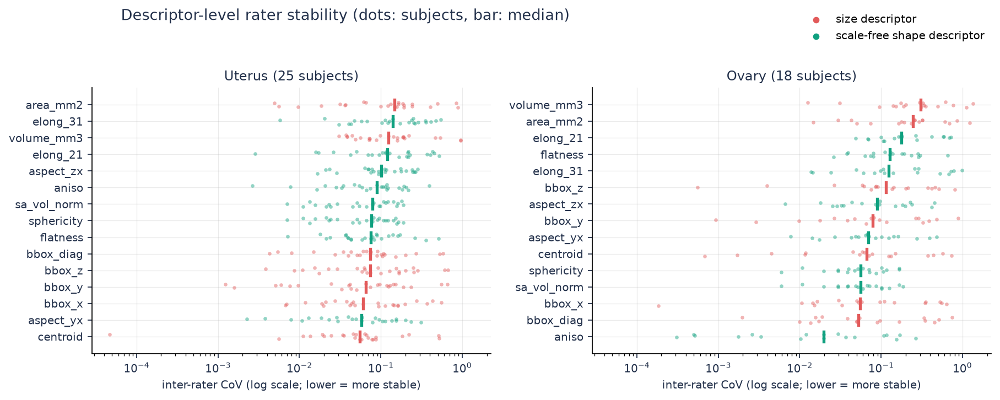
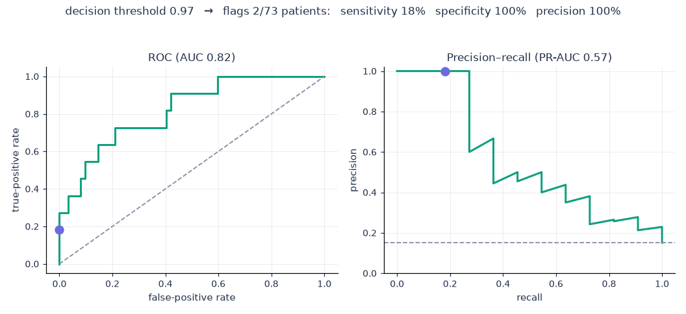

# shape-demographics (CAPI-WOMEN)

**Shape-based phenotyping of female pelvic organs.**

An intensity-free shape pipeline applied to female pelvic organs: uterine-corpus
shape carries a weak, size-dominated age signal (not the fibroids), ovarian/uterine
shape predicts the endometrioma annotation within one site while multi-site labels
mislead, and scale-free shape varies less across raters than size on family
averages. This repository accompanies our paper for the
[CAPI-WOMEN Workshop](https://www.capiwomen.com/), the joint Computer-Assisted
Pelvic Imaging (CAPI) and Women's Health (WOMEN) workshop at MICCAI 2026
(Strasbourg, October 1, 2026).




*The pipeline on one UMD subject: a T2 slice, the dataset's own multi-label segmentation, the raw
marching-cubes surface (the 6.6 mm slice spacing is visible as terracing — nothing is smoothed),
and the 2,048-point cloud the descriptors are computed from. Imaging: UMD dataset (Pan et al.,
Scientific Data 2024), CC BY 4.0.*

> **Reproducibility contract.** No number in the paper is hand-typed. Every
> statistic is generated from files in `experiments/` by `shapedem/paperb.py`.

> `_workspace/` and `.venv/` are empty by default — run `bash setup.sh` and the
> download script to populate them. Pre-computed results are already in
> `experiments/`.

The manuscript is included in [`paper/`](paper/).

If you find this work useful, please cite:

> Gijs Luijten, Merlin Engelke, Richard Ruppel, and Jan Egger, "A Multi-Site
> Label Trap in Shape-Based Endometriosis Detection: What Female Pelvic-Organ
> Shape Does (and Does Not) Encode," CAPI-WOMEN Workshop. In: *Medical Image
> Computing and Computer Assisted Intervention -- MICCAI 2026 Satellite
> Events*, Lecture Notes in Computer Science, Springer, 2026, to appear.

---

## Key Findings

- **Uterine-corpus** shape carries a weak age signal (R^2 0.14, MAE 8.9 yr on 300 women; cohort-mean baseline 10.2 yr); **not** fibroids (R^2 -0.31)
- The endometrioma **annotation** is predictable **within one site** (D2 AUC 0.83, ~11 positive cases)
- **Multi-site label trap**: annotation prevalence 78% vs 15% misleads pooled CV (AUC 0.64) and collapses cross-site transfer (AUC 0.27)
- **Inter-rater robustness**: on family averages, scale-free shape varies less across raters than size (uterus mean CoV 0.117 vs 0.142; ovary 0.147 vs 0.228), though the ordering reverses at the uterus median



<p>


</p>

*Left: the age signal is size-dominated — shape-only does worse than always predicting the cohort
mean (dashed line). Right: rater stability per descriptor; the size and shape families interleave,
so family averages hide the extremes (surface area and volume are the least stable descriptors).*


## The headline number, explained

ROC-AUC answers one question: if you draw one annotation-positive and one negative patient at
random, how often does the model rank the positive one higher? 0.5 is coin-flip ranking. The
PR curve tells the harsher story under 15% prevalence: precision at each level of recall,
against a random-ranker baseline equal to the prevalence. A single AUC also hides that every
deployment must pick a decision threshold. The sweep below plays through that choice on the
stored out-of-fold predictions (GitHub READMEs cannot embed an interactive slider, so this
one drives itself):



Both figures use the pooled out-of-fold predictions in `experiments/endomri_predictions.csv`
(AUC 0.82); the paper's headline 0.826 is the mean across the five CV folds. Regenerate with
`python scripts/make_readme_figures.py`.

---

## Quick Start (no data download, ~2 minutes)

```bash
bash setup.sh                      # creates ./.venv and installs the package (pip)
source .venv/bin/activate
python example/run_example.py      # offline synthetic demo
```

---

## Installation

### Option A: venv (recommended)

```bash
bash setup.sh
source .venv/bin/activate
```

`setup.sh` auto-detects a working Python 3.10--3.13 and creates a virtual
environment. Override with `PYTHON=python3.x bash setup.sh`.

### Option B: conda

```bash
conda env create -f environment.yml
conda activate shapedem
pip install -e .
```

### Option C: exact reproducibility

```bash
pip install -r requirements.lock.txt
pip install -e .
```

`requirements.lock.txt` pins every transitive dependency to the versions used
for the published results (Linux x86_64, Python 3.11).

---

## Data

| Dataset | Subjects | License | Source |
|---|---|---|---|
| UMD (uterine myoma MRI) | 300 | CC BY 4.0 | Figshare 23541312 |
| UT-EndoMRI (endometriosis) | 124 | Non-commercial research | Zenodo 13749613 |

Download:

```bash
bash scripts/download_capi.sh      # fetch UMD + UT-EndoMRI datasets
```

The download places ~12 GB of data into `_workspace/data/`. Running
`--step extract` then populates `_workspace/features/` with extracted shape
caches. Neither is required for inspecting results — `experiments/` already
ships with all pre-computed CSVs, JSONs, tables, and figures.

### Paths

```bash
export SHAPEDEM_ROOT=/path/to/large/disk    # <-- SET THIS
```

All runtime artifacts (downloaded data, extracted features, cache) go under
`$SHAPEDEM_ROOT`. Defaults to `./_workspace` if unset.

---

## Reproducing All Results

```bash
python -m shapedem.cli paperb --step all
```

This single command runs three stages in sequence:

<details>
<summary><b>Stage details (click to expand)</b></summary>

| Step | What it does | Output |
|---|---|---|
| `--step extract` | Downloads and extracts organ shapes from UMD (300 uterine myoma MRI) and UT-EndoMRI (124 endometriosis MRI, 2 sites). Parses age from DICOM metadata (UMD) and endometrioma labels from mask file presence (UT-EndoMRI). Applies marching cubes + surface sampling to uterus, ovary, and myoma masks. | `experiments/umd_labels.csv`, `experiments/endomri_labels.csv`, feature cache in `_workspace/features/` |
| `--step analyze` | Trains and evaluates models via 5-fold CV: age regression from uterine shape (UMD), endometrioma detection (UT-EndoMRI) with pooled CV, within-site CV (D1/D2 separately), and cross-site transfer (train D1 -> test D2). Also runs inter-rater agreement analysis (coefficient of variation across rater segmentations). | `experiments/umd_results.json`, `experiments/endomri_results.json`, `experiments/rater_agreement.csv`, `experiments/rater_cov_raw.csv` |
| `--step tables` | Generates LaTeX tables, result macros, and a figure from the experiment files above. | `experiments/tables/*.tex`, `experiments/results_macros.tex`, `experiments/figures/umd_age.png` |

</details>

---

## Reproducibility Note

All results use classical models (XGBoost, 5-fold CV) with fixed seeds. Results
are deterministic on the same platform. Minor numeric differences across
CPU architectures (x86 vs ARM) may occur due to floating-point ordering, but
conclusions are robust. After a re-run, `scripts/check_reproduction.py`
compares a regenerated `results_macros.tex` against a reference copy and fails
on any changed value.

---

## Repository Layout

```
shapedem/                  Python package
  cli.py                   command-line entry point
  paperb.py                CAPI-WOMEN extraction & analysis (UMD + UT-EndoMRI)
  shapes/extract.py        mask -> marching cubes -> point cloud + FOV-truncation QC
  shapes/descriptors.py    correspondence-free descriptors (size vs scale-free shape)
  train/baselines.py       XGBoost / linear CV with class rebalancing
configs/default.yaml       organs, paths, label definitions
experiments/               result CSVs/JSONs, figures, tables -- git-tracked
tests/                     unit tests (pytest)
example/                   offline synthetic demo
```

---

## Tests

```bash
pip install -e ".[dev]" && pytest -q
```

---

## Ethics and Responsible Use

Pelvic-organ shape may be patient-specific, though the correspondence-free
descriptors studied here carry limited discriminative signal. Shared
segmentations should be treated as potentially identifiable. This work studies only organ shape -- no raw
images are stored or distributed. The datasets are publicly available with
appropriate licenses and ethics approvals from their originating institutions.

We predict **age and endometrioma presence only**. The inter-rater robustness
results are intended to inform pipeline design, not to rank individual raters.
The multi-site label trap finding is a **methodological caution**, not a
criticism of either dataset's annotation protocol.

---

## Funding

This research was supported by the REACT-EU project KITE (grant number
EFRE-2920801977, Plattform für KI-Translation Essen, https://kite.ikim.nrw/) and by
the German Federal Ministry of Research, Technology and Space (BMFTR) Network of
University Medicine 3.0: "NUM 3.0", Grant No. 01KX2524, Project: RACOON.

---

## Use of Large Language Models

Large language models were used to assist with literature search, code
scaffolding, and drafting. All study design, code, experiments, and results
are the work of the authors; the final text was written by the first author
and edited with LLM assistance. See `DISCLAIMER.md`.

---

## License

Code: MIT (see `LICENSE`). The UMD dataset retains its own license (CC BY 4.0);
the UT-EndoMRI dataset is available for non-commercial research use only.
Derived shape descriptors are redistributed only where the dataset license
permits.
